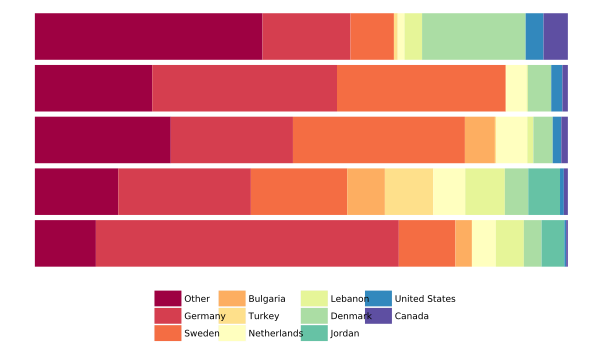
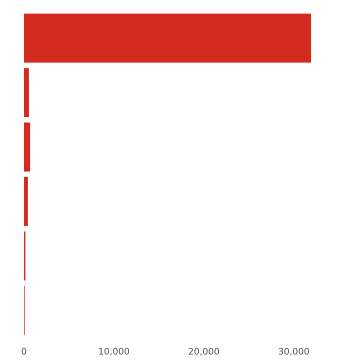
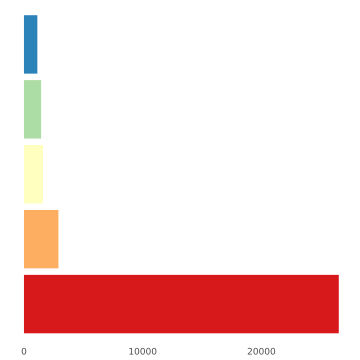
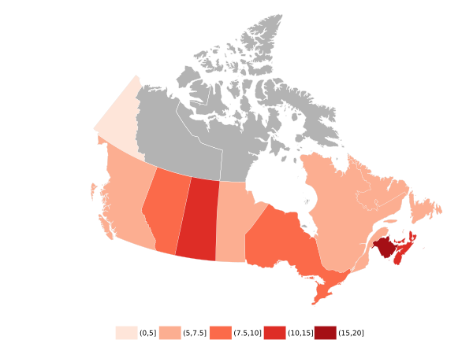
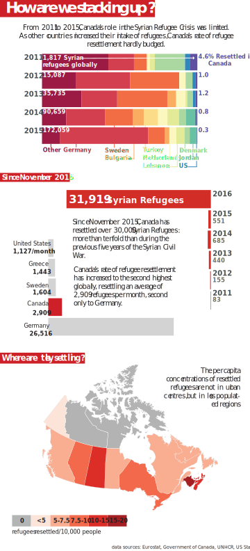

# GEOB472: Syrian Refugees Infographic
Katharine MacIntosh  


# Introduction

I have included below all of the code, data sources and intermediate steps for Assignment 2.

Original unprocessed datasets are available at [https://github.com/kmacintosh/syrian-refugees/tree/master/data](https://github.com/kmacintosh/syrian-refugees/tree/master/data).

Intermediate datasets are available here [https://github.com/kmacintosh/syrian-refugees/tree/master/output](https://github.com/kmacintosh/syrian-refugees/tree/master/output).

## UNHCR Visualization Effectiveness

I think the interactive visualization is effective in a few ways, but it also doesn’t answer some of the questions I am interested in. 

Overall, the visualization is pleasing to the eye, balanced and has good visual hierarchy. I think the start screen is very effective. Before you’ve even clicked on anything, it tells the user what the variables are, what they can display and filter for and generally how to operate the visualization. The start screen itself is semi-transparent, allowing the user to take in the map elements, with instruction, without getting overwhelmed by all the elements. To me, at first, this seemed like a minor and inconsequential thing, but upon further reflection I think that without it the map would be more difficult to navigate and I think the map user would be more likely overwhelmed and shut down. 

I also like the detailed definition of the variables they are mapping, giving the audience the specific conventions that define the terms. Additionally, each term is accompanied by a colour-coded sidebar relating it to its representative colour on the map. This is very effective. Without this, the dense text would be more onerous to get through. Being able to visually associate it with the spatial visualization helps to parse the information more efficiently. 

The pie chart/proportional circle symbolization is appropriate and the transparency of the symbols manages to limit cluttering of overlapping circles. 

For the data that this visualization displays, it is effective. I would like to be see more, however, knowing how much data they have; for instance, the breakdown by country of ‘Persons of Concern’ within a country. For the level of detail and effectiveness of the visualization, it does seem that the available visualization are somewhat basic.

# Load R packages


```r
library(tidyverse)
library(stringr)
library(ggalt)
library(sp)
library(rgeos)
library(countrycode)
```

# Data sources

## UNHCR refugee data


```r
syrian_data <- read_csv("data/syrian-refugees_unhcr.csv", 
                        na = c("", "*")) 
# merging and creating new columns for total accepted/rejected
syrian_data <- syrian_data %>% 
  mutate(total_recognized = convention_status + 
           coalesce(nonconvention_status, 0L),
         rejected_closed = rejected + otherwise_closed) 
# selecting countries with greater than 100 asylum-seekers 2011-2014
country_selector <- syrian_data %>% 
  filter(year >= 2011, year <=2014) %>% 
  group_by(country) %>% 
  summarise(total_recognized = sum(total_recognized, na.rm = TRUE)) %>% 
  ungroup() %>% 
  filter(total_recognized >= 100) %>% 
  mutate(rank = rank(desc(total_recognized))) %>% 
  select(-total_recognized)
# cleaning
syrian_data <- syrian_data %>% 
  # filter for countries, join with country ranks, gets rid of other countries
  inner_join(country_selector, by = "country") %>%
  # RSD type to uppercase
  mutate(rsd_type = toupper(rsd_type)) %>% 
  # filter for appropriate RSD type
  filter(rsd_type %in% c("G / FI", "G / NA", "U / FI", "G / IN")) %>% 
  # filter for years since 2007
  filter(year >= 2007) %>% 
  # change names to match world bank dataset
  mutate(country = ifelse(country == "Rep. of Moldova", "Moldova", country),
         country = ifelse(country == "Czech Rep.", "Czech Republic", country),
         country = ifelse(country == "United States of America",
                          "United States", country))
# output the cleaned data set
write_csv(syrian_data, "output/syrian-refugees_unhcr_clean.csv")
# stripping table to columns that will be used for graphs
syrian_data <- syrian_data %>% 
  group_by(country, year) %>% 
  summarise(rank = min(rank),
            total_decisions = sum(total_decisions, na.rm = TRUE), 
            total_recognized = sum(total_recognized, na.rm = TRUE), 
            rejected_closed = sum(rejected_closed, na.rm = TRUE),
            applied = sum(applied, na.rm = TRUE)) %>% 
  ungroup()
```

## GDP and population from World Bank

Dataset (WB Code): NY.GDP.MKTP.CD


```r
# population
population_data <- read_csv("data/population_world-bank.csv")
#filtering and joining population data
population_data <- population_data %>%
  #changes country variable name, and gathers data from wide to long 
  select(country = `Country Name`, starts_with("2")) %>% 
  gather(year, population, -country) %>% 
  mutate(year = as.integer(year),
         population = as.numeric(population))
# join back to refugee data
syrian_data <- syrian_data %>% 
  inner_join(population_data, by = c("country", "year")) 
# gdp
gdp_data <- read_csv("data/gdp_world-bank.csv", na = c("", ".."))
names(gdp_data)[1] <- "country"
gdp_data <- gdp_data %>%
  # changes country variable name, and gathers data from wide to long 
  select(country = `Country Name`, starts_with("2")) %>% 
  gather(year, gdp, -country) %>% 
  mutate(year = as.integer(substr(year, 1, 4)),
         gdp = as.numeric(gdp))
# join back to refugee data
syrian_data <- syrian_data %>% 
  inner_join(gdp_data, by = c("country", "year"))
write_csv(syrian_data, "output/syrian-refugees_for-plotting.csv")
```

## 2016 refugee data from Eurostat

Dataset: Asylum and first time asylum applicants by citizenship, age and sex Monthly data (rounded)


```r
eu_2016 <- read_csv("data/syrian-refugees_eu_eurostat.csv", na = c(":", ""))
# cleaning and filtering
eu_2016 <- eu_2016 %>% 
  filter(CITIZEN == "Syria",
         ASYL_APP == "First time applicant",
         !GEO %in% c("European Union (28 countries)", "Total")) %>% 
  mutate(Value = str_replace_all(Value, " ", ""),
         Value = as.integer(Value),
         GEO = ifelse(GEO == "Germany (until 1990 former territory of the FRG)",
                      "Germany", GEO)) %>% 
  group_by(GEO) %>% 
  summarise(mean_monthly_rec = mean(Value, na.rm = TRUE)) %>% 
  ungroup() %>% 
  rename(country = GEO)
# manually adding in canada and us, taken from web
refugees_2016 <- data_frame(country = c("Canada", "United States"),
                            mean_monthly_rec = c(31919 / 11, 12400 / 11)) %>% 
  bind_rows(eu_2016) %>% 
  mutate(mean_monthly_rec = round(mean_monthly_rec))
write_csv(refugees_2016, "output/syrian-refugees-2016.csv")
```

## Canadian refugee data

Dataset: Canada - Admissions of Syrian Refugees by Province/Territory of Intended Destination, Gender, Age Group and Immigration Category, November 4th, 2015 - July 31st, 2016


```r
refugees_canada <- read_csv("data/syrian-refugees_canada_2016.csv")
```

## Canadian provincial boundaries

I downloaded 1:50,000 provincal boundaries for Canada from [Natural Earth](http://www.naturalearthdata.com/downloads/50m-cultural-vectors/).


```r
f <- paste0("data/ne_50m_admin_1_states_provinces_lakes/",
            "ne_50m_admin_1_states_provinces_lakes.shp")
can_prov <- raster::shapefile(f)
# remove us state boundaries
can_prov <- subset(can_prov, iso_a2 == "CA")
# make feature IDs the 2-letter province code
row.names(can_prov) <- can_prov$postal
# in order to map in ggplot, must convert to dataframe
can_prov_df <- fortify(can_prov)
```

# Plots

Here I construct the component plots that will make up the infographic. I do most of the labelling in Illustrator, so I leave the plots unlabelled for now.

## Proportion of refugees by destination

This gives a visual sense of where the Syrian Refugees were accepted as refugees from 2011-2015.


```r
# stacked bar
country_totals <- syrian_data %>% 
  # group countries outside top 8 together as "other"
  mutate(country = ifelse(rank <= 8 | country %in% c("Canada", "United States"),
                          country, "Other")) %>% 
  filter(year >= 2011) %>% 
  group_by(year, country) %>% 
  summarise(total_recognized = sum(total_recognized, na.rm = TRUE)) %>% 
  ungroup() %>% 
  # set factor order for plotting
  mutate(country = factor(country,
                          levels = c("Other", "Germany", "Sweden", 
                                     "Bulgaria", "Turkey", "Netherlands",
                                     "Lebanon", "Denmark", "Jordan", 
                                     "United States", "Canada" )),
         year = factor(year, levels = 2015:2011)) %>%  
  arrange(country)

# stacked bar
ggplot(country_totals,
         aes(x = year, y = total_recognized, fill = factor(country))) +
  geom_bar(stat = "identity", position = "fill") +
  coord_flip() +
  scale_fill_brewer(palette = "Spectral") +
  scale_y_continuous(labels = scales::percent) +
  theme(axis.line = element_blank(),
        axis.text.x = element_blank(), axis.text.y = element_blank(),
        axis.ticks = element_blank(),
        axis.title.x = element_blank(), axis.title.y = element_blank(),
        panel.background = element_blank(),
        panel.border = element_blank(),
        panel.grid.major = element_blank(),
        panel.grid.minor = element_blank(),
        plot.background = element_blank(),
        legend.position = "bottom",
        legend.key.width = unit(1, "cm"),
        legend.title = element_blank(),
        text = element_text(family = "Helvetica Neue Light")) 
```

<!-- -->

In addition, I need the total number of refugees accepted, and the proportion going to Canada, for each year. I'll put these numbers on the infographic in Illustrator.


```r
country_totals %>% 
  group_by(year) %>% 
  summarize(total = sum(total_recognized),
            canada = sum(ifelse(country == "Canada", total_recognized, 0)),
            canada_pct = 100 * canada / total) %>% 
  knitr::kable()
```


year     total   canada   canada_pct
-----  -------  -------  -----------
2015    172161      551    0.3200493
2014     90659      685    0.7555786
2013     35735      440    1.2312859
2012     15087      155    1.0273746
2011      1817       83    4.5679692

## A changing Canada


```r
# refugees going to canada over time
change_in_canada <- syrian_data %>% 
  filter(country == "Canada", 
         year >= 2011) %>% 
  select(year, total_recognized) %>% 
  # manually add 2016 data
  bind_rows(data_frame(year = 2016, total_recognized = 31919))
# bar chart
ggplot(change_in_canada, aes(x = factor(year), y = total_recognized)) +
  geom_bar(stat = "identity", fill = "#D52B1E") +
  scale_y_continuous(labels = scales::comma, limits = c(0, 35000)) +
  coord_flip() +
  theme(axis.line = element_blank(),
      axis.text.y = element_blank(),
      axis.ticks = element_blank(),
      axis.title.x = element_blank(), axis.title.y = element_blank(),
      panel.background = element_blank(),
      panel.border = element_blank(),
      panel.grid.major = element_blank(),
      panel.grid.minor = element_blank(),
      plot.background = element_blank(),
      legend.position = "bottom",
      legend.key.width = unit(1, "cm"),
      legend.title = element_blank(),
      text = element_text(family = "Helvetica Neue Light")) 
```

<!-- -->

## Comparing countries in 2016


```r
refugees_2016 %>% 
  filter(country %in% c("Canada", "United States", "Germany", "Sweden",
                        "Greece")) %>% 
  mutate(country = factor(country, levels = c("Germany", "Canada", "Sweden", 
                                              "Greece", "United States"))) %>% 
  arrange(country) %>% 
  ggplot(aes(x = country, y = mean_monthly_rec, fill = country)) +
    geom_bar(stat = "identity") +
    coord_flip() +
    scale_fill_brewer(palette = "Spectral") +
    theme(axis.line = element_blank(),
          axis.text.y = element_blank(),
          axis.ticks = element_blank(),
          axis.title.x = element_blank(), axis.title.y = element_blank(),
          panel.background = element_blank(),
          panel.border = element_blank(),
          panel.grid.major = element_blank(),
          panel.grid.minor = element_blank(),
          plot.background = element_blank(),
          text = element_text(family = "Helvetica Neue Light")) +
    guides(fill = "none")
```

<!-- -->

## Map of provinces accepting refugees


```r
# calculate refugees per 10,000 residents, and classify
can_prov_df <- refugees_canada %>% 
  mutate(refugees_pc = 10000 * refugee_resettled / population,
         resettled_binned = cut(refugees_pc,
                                breaks = c(0, 5, 7.5, 10, 15, 20))) %>% 
  # join to provincial boundaries
  left_join(can_prov_df, ., by = c("id" = "postal"))
# canada albers projection
can_albers <- paste0("+proj=aea +lat_1=50 +lat_2=70 +lat_0=40 +lon_0=-96 ",
                     "+x_0=0 +y_0=0 +ellps=GRS80 +datum=NAD83 +units=m +no_defs")
# map
ggplot(can_prov_df) +
  geom_polygon(aes(long, lat, group = group), 
               fill = "grey70", color = "white", size = 0.1) + 
  geom_polygon(aes(long, lat, group = group, fill = resettled_binned), 
               color = "white", size = 0.1) +
  coord_proj(can_albers) +
  scale_x_continuous(expand = c(0, 0)) +
  scale_y_continuous(expand = c(0, 0)) +
  scale_fill_brewer(palette = "Reds") +
  theme(axis.line = element_blank(),
        axis.text.x = element_blank(), axis.text.y = element_blank(),
        axis.ticks = element_blank(),
        axis.title.x = element_blank(), axis.title.y = element_blank(),
        panel.background = element_blank(),
        panel.border = element_blank(),
        panel.grid.major = element_blank(),
        panel.grid.minor = element_blank(),
        plot.background = element_blank(),
        legend.position = "bottom",
        legend.key.width = unit(1, "cm"),
        legend.title = element_blank(),
        text = element_text(family = "Helvetica Neue Light"))
```

<!-- -->

# Final Infographic



# Acknowledgements

I want to credit Matthew Strimas-Mackey for his time and instruction in R for this project.
